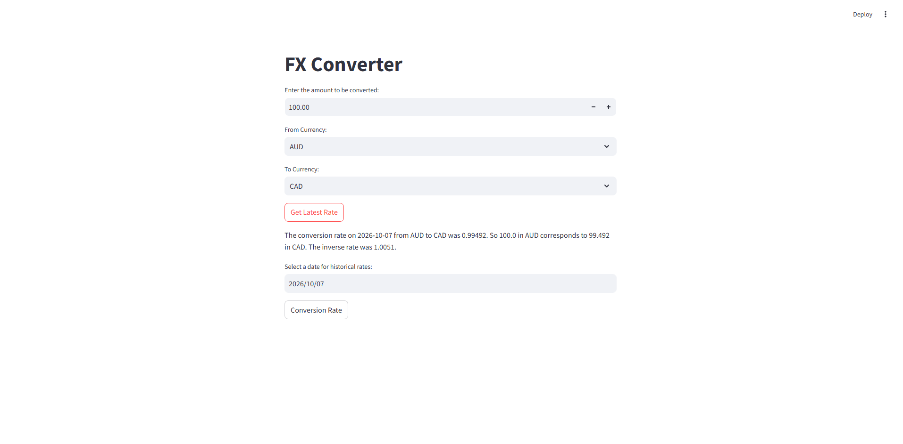
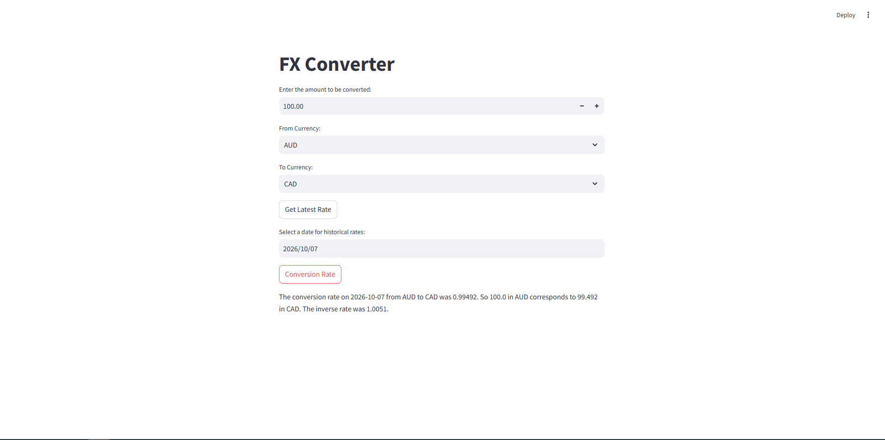

# FX Currency Converter

A simple currency exchange web application built with Python and Streamlit.

The application retrieves exchange rate data from the Frankfurter API and allows users to convert between different currencies using both the latest and historical exchange rates.

## Features

- Convert between multiple international currencies
- Retrieve the latest available exchange rate
- Check historical exchange rates by selecting a date
- Calculate the converted currency amount
- Display the inverse exchange rate
- Interactive web interface built with Streamlit

## Application Preview

### Latest Exchange Rate



### Historical Exchange Rate



## Technologies Used

- Python
- Streamlit
- Requests
- Frankfurter API

## Project Structure

```text
fx-currency-converter/
│
├── images/
│   ├── latest-rate.png
│   └── historical-rate.png
│
├── app.py
├── api.py
├── currency.py
├── frankfurter.py
├── requirements.txt
├── .gitignore
└── README.md
```

## How It Work
The application follows a simple workflow:
1. The user enters an amount to convert.
2. The user selects the source currency.
3. The user selects the target currency.
4. The application requests exchange rate data from the Frankfurter API.
5. The converted amount and inverse exchange rate are calculated.
6. The result is displayed through the Streamlit interface.
Users can also select a date to retrieve a historical exchange rate.

## Code Overview

### `app.py`

Contains the Streamlit user interface and handles user interactions such as:

- Entering an amount
- Selecting currencies
- Requesting the latest exchange rate
- Selecting a historical date
- Displaying conversion results

### `api.py`

Handles HTTP requests to the Frankfurter API.

### `frankfurter.py`

Contains functions for retrieving:

- Available currencies
- Latest exchange rates
- Historical exchange rates

### `currency.py`

Calculates the converted amount and inverse exchange rate and formats the final result.
